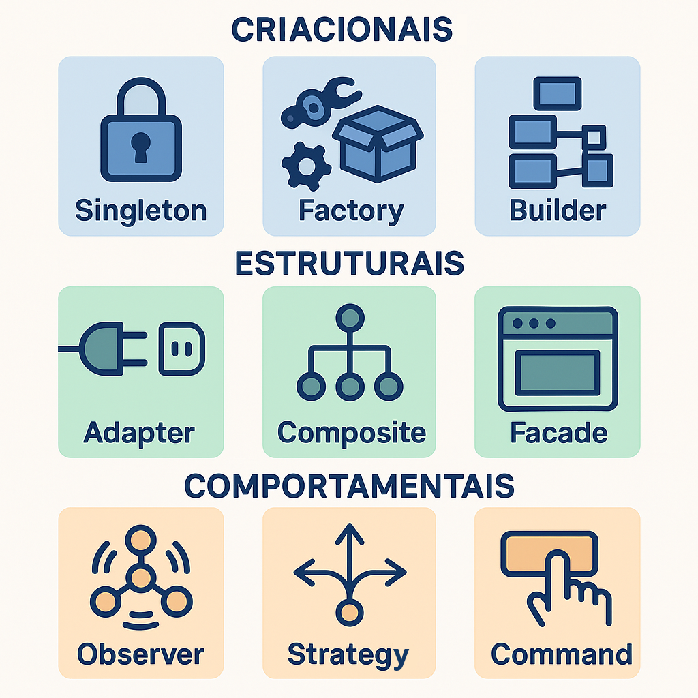

# 8. Padrões de Projeto

## 🔍 O que são padrões de projeto?

Padrões de projeto (_Design Patterns_) são **soluções reutilizáveis e comprovadas** para problemas recorrentes no desenvolvimento de software. Eles não são pedaços de código prontos, mas **estruturas conceituais** que podem ser adaptadas a diferentes contextos.

> Foram popularizados pelo livro _“Design Patterns: Elements of Reusable Object-Oriented Software”_ (GoF, 1994).

---

## 📚 Categorias clássicas (GoF)

| Categoria           | Descrição                                                                |
| ------------------- | ------------------------------------------------------------------------ |
| **Criacionais**     | Lidam com a criação de objetos, abstraindo o processo de instanciação    |
| **Estruturais**     | Tratam da composição de classes e objetos para formar estruturas maiores |
| **Comportamentais** | Lidam com a comunicação e interação entre objetos                        |

---

## 🧱 Exemplos de padrões clássicos

    

### 🏗️ Criacionais

- **Singleton**: Garante que uma classe tenha apenas uma instância e fornece um ponto global de acesso.
- **Factory Method**: Define uma interface para criação de objetos, mas permite que subclasses decidam qual classe instanciar.
- **Builder**: Separa a construção de um objeto complexo de sua representação.

### 🧩 Estruturais

- **Adapter**: Permite que interfaces incompatíveis trabalhem juntas.
- **Composite**: Compõe objetos em estruturas de árvore para representar hierarquias parte-todo.
- **Facade**: Fornece uma interface simplificada para um conjunto complexo de classes.

### 🔁 Comportamentais

- **Observer**: Define uma dependência um-para-muitos entre objetos, para que todos sejam notificados quando um mudar.
- **Strategy**: Permite selecionar algoritmos em tempo de execução, encapsulando-os em classes separadas.
- **Command**: Encapsula uma solicitação como um objeto, permitindo parametrização e enfileiramento de comandos.

---

## 🔍 Quando usar padrões?

- Quando um problema **ocorre repetidamente** em contextos semelhantes.
- Para **melhorar a comunicação** entre desenvolvedores (linguagem comum).
- Para **facilitar manutenção, extensão e testes**.
- Para **aplicar boas práticas consolidadas**.

---

## 💡 Dicas práticas

- Não use padrões desnecessariamente (_"overengineering"_).
- Entenda o problema antes de aplicar uma solução conhecida.
- Os padrões ajudam a manter **coesão, baixo acoplamento e reutilização**.
- Reforce os princípios SOLID ao aplicar padrões.

---

## 📚 Referências

- Gamma, E., Helm, R., Johnson, R., & Vlissides, J. – _Design Patterns: Elements of Reusable Object-Oriented Software_
- Freeman, E., & Robson, E. – _Head First Design Patterns_
- Robert C. Martin – _Clean Architecture_
- Refactoring.Guru – [https://refactoring.guru/pt-br/design-patterns](https://refactoring.guru/pt-br/design-patterns)
