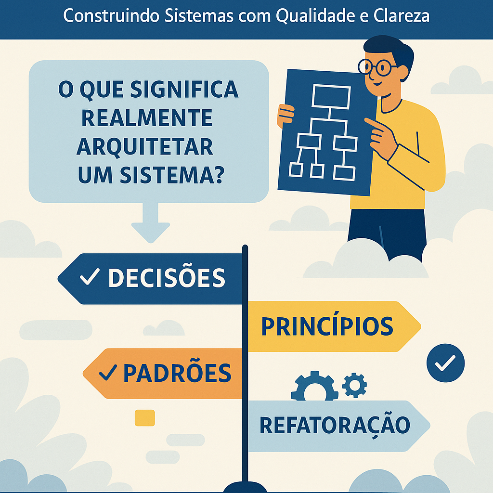
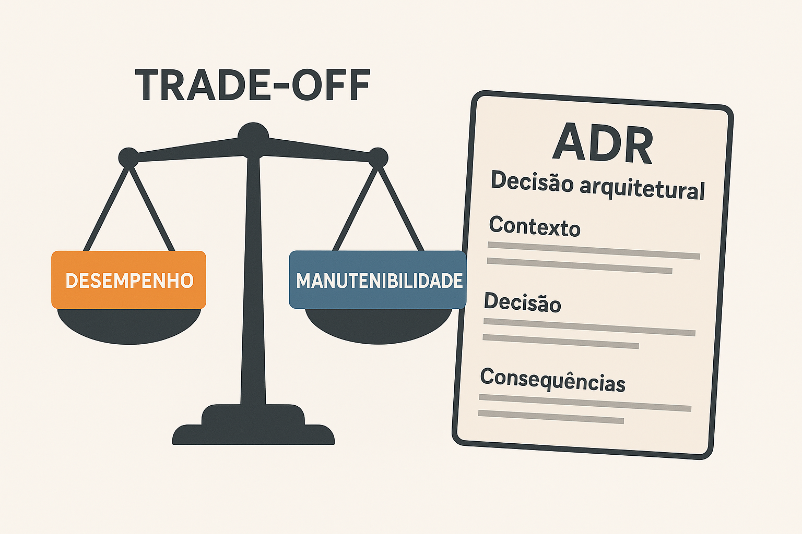
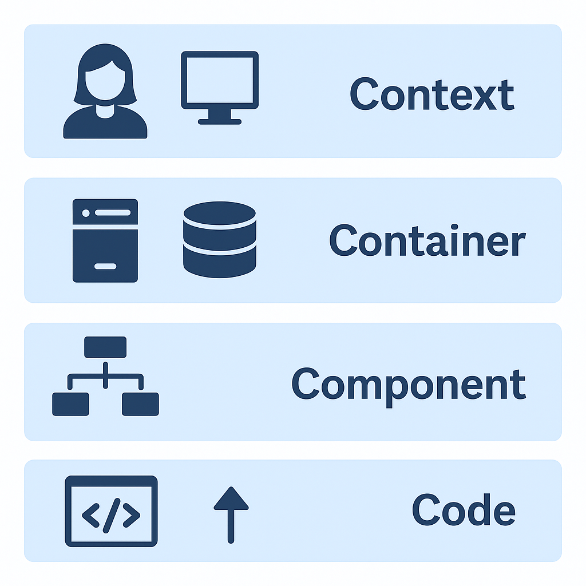
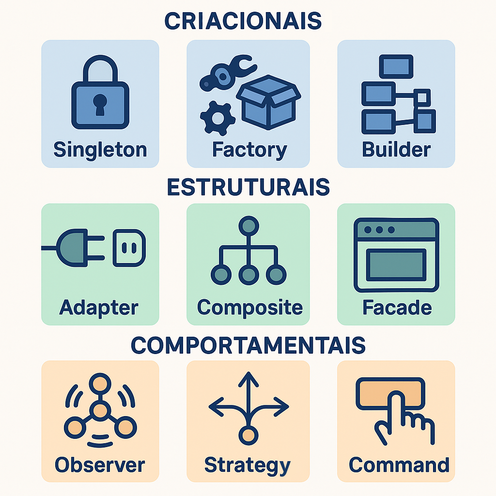

# 📘 Arquitetura e Desenho de Software: Construindo Sistemas com Qualidade e Clareza

<p align="right">Professor Dr. Jonas Lopes de Vilas Boas</p>
<p align="center">
    
</p>

Você já se perguntou por que alguns sistemas são simples de entender, evoluir e manter — enquanto outros parecem verdadeiros labirintos impossíveis de decifrar?

Este material foi criado para **te ajudar a enxergar além do código**. Aqui, você vai mergulhar nos conceitos essenciais de **arquitetura e desenho de software**, entendendo como boas decisões estruturais podem **transformar um software frágil em uma base sólida para inovação**.

Ao longo deste conteúdo, vamos explorar:

✅ O que realmente significa arquitetar um sistema  
✅ Como decisões de projeto afetam a qualidade e a manutenibilidade  
✅ Princípios que orientam o desenvolvimento de código limpo e modular  
✅ Padrões e estilos que se repetem nas melhores soluções da indústria  
✅ Técnicas práticas de refatoração para melhorar o que já foi construído

Este não é um material teórico para ficar na gaveta. É um **guia prático e visual** para quem quer desenvolver software com propósito, clareza e visão de longo prazo.

> Se você já sabe programar, agora é hora de **pensar como um arquiteto**.

## Índice de Seções

1. [O que é e o que não é Arquitetura de Software?](#1-o-que-é-e-o-que-não-é-arquitetura-de-software)
2. [Qualidade de Software](#2-qualidade-de-software)
3. [Decisões Arquiteturais e Trade-offs](#3-decisões-arquiteturais-e-trade-offs)
4. [Documentação Arquitetural](#4-documentação-arquitetural)
   - 4.1 [Modelo C4](#41-modelo-c4)
   - 4.2 [Diagrama de Caso de Uso (UML)](#42-diagrama-de-caso-de-uso-uml)
   - 4.3 [Diagrama de Classes (UML)](#43-diagrama-de-classes-uml)
   - 4.4 [Diagrama de Sequência (UML)](#44-diagrama-de-sequência-uml)
5. [Propriedades Fundamentais em Projetos de Software](#5-propriedades-fundamentais-em-projetos-de-software)
6. [Princípios de Desenvolvimento de Software (com foco em SOLID)](#6-princípios-de-desenvolvimento-de-software-com-foco-em-solid)
7. [Padrões e Estilos Arquiteturais](#7-padrões-e-estilos-arquiteturais)
   - 7.1 [Padrão MVC (Model-View-Controller)](#71-padrão-mvc-model-view-controller)
   - 7.2 [Padrão SOA (Service-Oriented Architecture)](#72-padrão-soa-service-oriented-architecture)
   - 7.3 [Padrão Broker](#73-padrão-broker)
   - 7.4 [Padrão MVVM (Model-View-ViewModel)](#74-padrão-mvvm-model-view-viewmodel)
8. [Padrões de Projeto](#8-padrões-de-projeto)
9. [Refatoração](#9-refatoração)
10. [Conclusão](#conclusão)

---

## <br><br>

[Índice](#índice-de-seções)

# 1. O que é e o que não é Arquitetura de Software?

## 📌 Conceito Principal

A **arquitetura de software** é o conjunto de decisões estruturais fundamentais que determinam a organização de um sistema. Ela define os **componentes principais**, suas **responsabilidades**, como eles **interagem** e como são **implantados**. Essas decisões são críticas porque influenciam diretamente a manutenibilidade, desempenho, escalabilidade e outros atributos do sistema ao longo do tempo.

> “A arquitetura de software representa as decisões significativas sobre a organização de um sistema de software, incluindo a seleção dos elementos estruturais e suas interfaces.”  
> — _Bass, Clements e Kazman (Software Architecture in Practice)_

---

## 🧩 O que envolve arquitetura de software?

- **Divisão em módulos/componentes**
- **Definição de interfaces e contratos**
- **Escolha de tecnologias e frameworks principais**
- **Estabelecimento de estilos arquiteturais** (ex: monolito, microserviços, orientado a eventos)
- **Consideração de atributos de qualidade** (desempenho, segurança, disponibilidade, etc.)
- **Definição de como o sistema será implantado, monitorado e evoluído**

---

## 🚫 O que NÃO é arquitetura de software?

- **Não é o código em si**, embora ele reflita a arquitetura
- **Não é a escolha de nomes de variáveis ou métodos**
- **Não é apenas diagramas**, apesar de serem ferramentas úteis de comunicação
- **Não é algo que só acontece no início do projeto** – a arquitetura evolui
- **Não se limita à escolha de ferramentas ou linguagens**, embora essas escolhas possam ter impacto arquitetural

---

## 🎯 Relação com Engenharia de Software

A arquitetura é **parte da engenharia de software**, mas com foco específico em **decisões estruturais de longo prazo**.

| Engenharia de Software                           | Arquitetura de Software                                   |
| ------------------------------------------------ | --------------------------------------------------------- |
| Abrange o processo completo de desenvolvimento   | Foca na estrutura e organização do sistema                |
| Inclui análise de requisitos, testes, manutenção | Envolve decisões sobre componentes, estilos e tecnologias |
| Aplica boas práticas para todo o ciclo de vida   | Define as bases sobre as quais o sistema será construído  |

---

## 📚 Referências

- Fowler, M. (2003). _Who needs an architect?_

---

## <br><br>

[Índice](#índice-de-seções)

# 2. Qualidade de Software

A qualidade de software refere-se ao grau em que um sistema atende às necessidades e expectativas dos usuários, tanto em relação ao seu comportamento funcional quanto aos seus atributos não funcionais, como desempenho, segurança, manutenibilidade e usabilidade. Um software de qualidade não é apenas aquele que "funciona corretamente", mas também aquele que é confiável, fácil de entender, modificar, testar e escalar ao longo do tempo. A busca por qualidade deve estar presente em todas as fases do desenvolvimento, desde a definição de requisitos até a manutenção, exigindo o uso de boas práticas de engenharia, arquitetura bem definida, testes rigorosos e atenção contínua aos feedbacks reais dos usuários.

## 🧩 O que são requisitos não funcionais?

Requisitos não funcionais (RNFs) descrevem **como** o sistema deve se comportar, e não **o que** ele deve fazer. Eles estão diretamente relacionados aos **atributos de qualidade** do software e são fundamentais para orientar decisões arquiteturais.

---

## 🏗️ Relação entre arquitetura e qualidade

A arquitetura de software **não apenas viabiliza funcionalidades**, mas também **garante que o sistema atenda a critérios de qualidade** como desempenho, segurança e manutenibilidade.

A negligência com os RNFs pode tornar o sistema difícil de manter, escalar ou até mesmo usar com eficiência.

---

## 🔍 Principais atributos de qualidade

| Atributo             | Descrição                                                    |
| -------------------- | ------------------------------------------------------------ |
| **Desempenho**       | Tempo de resposta, throughput, uso de recursos               |
| **Escalabilidade**   | Capacidade de lidar com aumento de carga                     |
| **Disponibilidade**  | Capacidade de manter-se acessível mesmo com falhas           |
| **Manutenibilidade** | Facilidade de corrigir, adaptar ou melhorar o sistema        |
| **Reusabilidade**    | Facilidade de reutilizar componentes em diferentes contextos |
| **Segurança**        | Proteção contra acessos não autorizados ou uso indevido      |
| **Usabilidade**      | Facilidade de aprendizado e uso por parte dos usuários       |
| **Portabilidade**    | Facilidade de migração para diferentes ambientes             |
| **Confiabilidade**   | Capacidade de operar sem falhas ao longo do tempo            |
| **Testabilidade**    | Facilidade de validar o comportamento esperado do sistema    |

<p align="center">
    
</p>

---

## 🎯 Como os RNFs influenciam a arquitetura?

- Um sistema com **alta escalabilidade** pode exigir arquitetura de **microserviços** e mecanismos de balanceamento de carga.
- Um sistema que exige **baixa latência** pode demandar **processamento assíncrono** e uso de **cache**.
- Um sistema com **alta segurança** pode precisar de **camadas de autenticação**, **criptografia** e **controle de acesso detalhado**.
- Um sistema com forte **manutenibilidade** pode adotar **camadas bem definidas** e **baixo acoplamento**.

---

## 💡 Dica prática

Ao levantar requisitos de um sistema, pergunte:

> “Além de o que o sistema precisa fazer, **quais qualidades ele precisa ter** para ser considerado bom?”

---

## 📚 Referências

- ISO/IEC 25010 – _Systems and software Quality Requirements and Evaluation (SQuaRE)_
- Bass, L., Clements, P., & Kazman, R. (2012). _Software Architecture in Practice_
- Rozanski, N., & Woods, E. (2011). _Software Systems Architecture: Working with Stakeholders Using Viewpoints and Perspectives_

---

## <br><br>

[Índice](#índice-de-seções)

# 3. Decisões Arquiteturais e Trade-offs

## 🧠 O que são decisões arquiteturais?

Durante o projeto de um sistema, diversas decisões precisam ser tomadas para estruturar sua arquitetura. Essas são chamadas de **decisões arquiteturais**, e envolvem escolhas que afetam a organização e a qualidade do sistema de forma significativa e de longo prazo.

Exemplos:

- Qual estilo arquitetural adotar? (Monolito, Microserviços, etc.)
- Que tipo de persistência usar? (SQL vs. NoSQL)
- Como será feito o balanceamento de carga?
- A comunicação será síncrona ou assíncrona?

---

## ⚖️ O que são trade-offs?

Cada decisão arquitetural envolve **compensações (trade-offs)**: ao otimizar um atributo de qualidade, outro pode ser prejudicado.

| Decisão                          | Trade-off Possível                            |
| -------------------------------- | --------------------------------------------- |
| Microserviços                    | +Escalabilidade, -Complexidade de implantação |
| Banco NoSQL                      | +Performance em leitura, -Consistência forte  |
| Comunicação assíncrona           | +Desempenho, -Dificuldade de rastreabilidade  |
| Armazenamento local vs. na nuvem | +Desempenho local, -Disponibilidade global    |

---

## 📝 Registrando decisões: ADR (Architectural Decision Record)

Um **ADR (Architectural Decision Record)** é um documento simples que registra uma decisão arquitetural tomada, incluindo:

- **Título da decisão**
- **Contexto** (por que essa decisão precisou ser feita)
- **Decisão** (o que foi decidido e por quê)
- **Consequências** (impactos e trade-offs)

### 📄 Exemplo de ADR

```
# ADR 001 - Utilizar banco de dados relacional (PostgreSQL)

## Contexto
Precisamos armazenar dados estruturados com forte consistência transacional.

## Decisão
Adotaremos PostgreSQL como banco relacional por ser robusto, open source e com suporte a consultas complexas.

## Consequências
+ Fácil modelagem de dados relacionais
+ Consistência garantida por ACID
- Menor performance para leitura massiva em grandes volumes
```

> ADRs ajudam a manter o histórico das decisões e são úteis para comunicação e manutenção.

<p align="center">
    
</p>

---

## 📚 Boas práticas

- Tome decisões **baseadas em requisitos de negócio e qualidade**.
- Considere sempre os **impactos de longo prazo**.
- Documente as decisões para que não se percam no tempo.
- Reavalie decisões antigas conforme o sistema evolui.

---

## 📚 Referências

- ThoughtWorks: _Documenting Architecture Decisions_ (Michael Nygard)
- Bass, L., Clements, P., & Kazman, R. (2012). _Software Architecture in Practice_
- Rozanski, N. & Woods, E. (2011). _Software Systems Architecture_

---

## <br><br>

[Índice](#índice-de-seções)

# 4. Documentação Arquitetural

## 🧩 Por que documentar a arquitetura?

A documentação arquitetural é essencial para **comunicar decisões**, **alinhamento entre equipes** e **facilitar a manutenção e evolução do sistema**. Sem ela, a arquitetura só existe na cabeça de quem projetou, o que dificulta a continuidade e a colaboração em projetos maiores.

---

## 🛠️ O que deve ser documentado?

A documentação pode incluir:

- **Visões arquiteturais** (componentes, camadas, comunicação, implantação, etc.)
- **Padrões e estilos adotados**
- **Decisões arquiteturais (ADRs)**
- **Atributos de qualidade e como foram tratados**
- **Riscos identificados e mitigados**
- **Diagramas explicativos**

---

## 🧭 Abordagens para documentação

### Modelo C4

Uma abordagem moderna e prática que define 4 níveis de abstração para visualizar sistemas:

1. **Contexto** – mostra o sistema como um todo e sua interação com usuários e outros sistemas.
2. **Containers** – detalha os principais executáveis ou serviços que compõem o sistema.
3. **Componentes** – mostra os módulos internos de cada container.
4. **Código** – exibe detalhes técnicos de classes, funções, bibliotecas, etc.

> O C4 é altamente recomendado por sua clareza e foco em comunicação.

---

## 🧰 Ferramentas comuns

| Ferramenta                | Tipo                    | Observações                                      |
| ------------------------- | ----------------------- | ------------------------------------------------ |
| **PlantUML**              | Diagramas UML           | Baseado em texto, fácil de versionar             |
| **Structurizr**           | Modelo C4               | Ferramenta moderna para visualização em camadas  |
| **Draw.io**               | Diagramas em geral      | Interface gráfica simples e gratuita             |
| **Lucidchart**            | Diagramas colaborativos | Recurso visual e colaboração em tempo real       |
| **Markdown + mermaid.js** | Diagrama + texto        | Ideal para documentação viva (e.g., GitHub Wiki) |

---

## 📊 Diagramas mais utilizados

| Diagrama                     | Finalidade                                                         |
| ---------------------------- | ------------------------------------------------------------------ |
| **Diagrama de Componentes**  | Mostra os módulos do sistema e suas dependências                   |
| **Diagrama de Sequência**    | Representa interações entre objetos ao longo do tempo              |
| **Diagrama de Implantação**  | Mostra como os componentes são distribuídos fisicamente            |
| **Diagrama de Casos de Uso** | Representa funcionalidades do sistema do ponto de vista do usuário |
| **Diagrama de Classes**      | Mostra a estrutura de dados orientada a objetos                    |

> Não é necessário usar todos os diagramas – use os que mais **ajudam a comunicar a arquitetura**.

---

## 💡 Boas práticas

- Mantenha a documentação **atualizada e acessível**.
- Prefira **diagramas simples e objetivos**.
- Documente **motivações** e **consequências** das decisões.
- Inclua **exemplos concretos** sempre que possível.
- Use **versionamento** para manter o histórico.

---

## 📚 Referências

- Simon Brown – _The C4 Model for visualising software architecture_
- ISO/IEC/IEEE 42010 – _Systems and software engineering — Architecture description_
- Bass, L., Clements, P., & Kazman, R. – _Software Architecture in Practice_
- Structurizr DSL – [https://structurizr.com](https://structurizr.com)

---

## <br><br>

[Índice](#índice-de-seções)

## 4.1 Modelo C4

O **Modelo C4** é uma abordagem moderna para documentação arquitetural proposta por Simon Brown, com o objetivo de **visualizar a arquitetura de software em diferentes níveis de abstração**, de forma simples e clara.

> C4 é uma sigla que representa os quatro níveis de visualização: **Contexto**, **Containers**, **Componentes** e **Código**.

---

### 🎯 Objetivos do C4

- Facilitar a **comunicação da arquitetura** com diferentes públicos (negócio, desenvolvedores, operações).
- Reduzir ambiguidade com **modelos padronizados e progressivos**.
- Promover **clareza, rastreabilidade e compreensão** do sistema.

---

### 🔷 Níveis do modelo C4

#### 1. **Contexto**

> Mostra o sistema como um todo e seus relacionamentos com usuários e sistemas externos.

- Foco: visão geral, fronteiras do sistema.
- Público-alvo: stakeholders, clientes, analistas.

#### 2. **Containers**

> Mostra os principais contêineres (ex: aplicações, serviços, banco de dados) que compõem o sistema.

- Foco: execução e comunicação entre partes maiores do sistema.
- Público-alvo: arquitetos, desenvolvedores backend/frontend.

#### 3. **Componentes**

> Detalha os componentes internos de cada container e como eles colaboram.

- Foco: estrutura modular interna de uma aplicação.
- Público-alvo: desenvolvedores da aplicação.

#### 4. **Código**

> Visão opcional que mostra como os componentes são implementados no nível de classes, funções, etc.

- Foco: detalhes técnicos de implementação.
- Público-alvo: desenvolvedores diretamente envolvidos com o código.
<br>
<br>
<p align="center">
    
</p>

---

### 🧠 Benefícios do modelo C4

- Ajuda a evitar a "confusão de diagramas" típica da UML.
- Permite **escalar a documentação conforme o público e a necessidade**.
- É compatível com ferramentas como Structurizr, PlantUML e mermaid.js.

---

### 📚 Referências

- Simon Brown – [https://c4model.com](https://c4model.com)
- _Software Architecture for Developers_ – Simon Brown
- Structurizr DSL – [https://structurizr.org](https://structurizr.org)

---

## <br><br>

[Índice](#índice-de-seções)

## 4.2 Diagrama de Caso de Uso (UML)

O **diagrama de caso de uso** é uma das ferramentas mais populares da UML (Unified Modeling Language) e serve para **representar as funcionalidades principais de um sistema do ponto de vista dos usuários** (atores).

Ele **não descreve como o sistema será implementado**, mas **o que ele deve fazer**, facilitando a comunicação entre desenvolvedores, analistas e clientes.

---

### 🎯 Objetivos do diagrama de caso de uso

- Identificar **atores externos** (usuários, sistemas ou dispositivos) que interagem com o sistema.
- Representar **funcionalidades esperadas** (casos de uso) do sistema.
- Fornecer uma **visão geral do comportamento** do sistema sem entrar em detalhes técnicos.

---

### 🧩 Elementos principais

| Elemento        | Representação     | Significado                                      |
| --------------- | ----------------- | ------------------------------------------------ |
| **Ator**        | Boneco (stickman) | Entidade externa que interage com o sistema      |
| **Caso de uso** | Elipse            | Funcionalidade oferecida pelo sistema            |
| **Associação**  | Linha             | Relação entre ator e caso de uso                 |
| **Sistema**     | Retângulo         | Delimita os casos de uso pertencentes ao sistema |
| **Relações**    | Include / Extend  | Reutilização ou extensão de comportamento        |

---

### 🔁 Relações comuns

- **Include**: Um caso de uso sempre executa outro.

  > Ex: “Realizar Compra” _include_ “Validar Pagamento”.

- **Extend**: Um caso de uso pode opcionalmente executar outro.
  > Ex: “Realizar Compra” _extend_ “Aplicar Cupom”.

---

### 💡 Exemplo de interpretação

> O ator "Cliente" pode "Realizar Pedido", que inclui "Selecionar Produto" e "Efetuar Pagamento".  
> Já o ator "Administrador" pode "Gerenciar Produtos" e "Visualizar Relatórios".

---

### 📚 Referências

- OMG UML Specification – [https://www.omg.org/spec/UML](https://www.omg.org/spec/UML)
- Larman, C. – _Applying UML and Patterns_
- Fowler, M. – _UML Distilled_

---

## <br><br>

[Índice](#índice-de-seções)

## 4.3 Diagrama de Classes (UML)

O **diagrama de classes** é um dos diagramas mais importantes da UML e é utilizado para **representar a estrutura estática do sistema** — ou seja, **as classes, atributos, métodos e os relacionamentos entre elas**.

Esse diagrama é amplamente utilizado durante o projeto orientado a objetos para visualizar a arquitetura interna de um sistema.

---

### 🎯 Objetivos do diagrama de classes

- Representar **entidades do sistema** e suas características.
- Modelar **relacionamentos estruturais** entre classes.
- Servir como base para o **desenho e implementação orientada a objetos**.
- Facilitar a **comunicação entre equipe técnica e análise de domínio**.

---

### 🧩 Elementos principais

| Elemento           | Representação                                                      |
| ------------------ | ------------------------------------------------------------------ |
| **Classe**         | Retângulo dividido em 3 seções: nome, atributos e métodos          |
| **Atributo**       | Nome + tipo (ex: `nome: String`)                                   |
| **Método**         | Nome + parâmetros + tipo de retorno (ex: `calcularTotal(): Float`) |
| **Associação**     | Linha sólida entre duas classes                                    |
| **Herança**        | Linha com triângulo apontando para a superclasse                   |
| **Agregação**      | Linha com losango branco                                           |
| **Composição**     | Linha com losango preto                                            |
| **Multiplicidade** | `1`, `*`, `0..1`, `1..*`, etc.                                     |

---

### 💡 Convenções úteis

- `+` público, `-` privado, `#` protegido
- Métodos e atributos devem ser nomeados com clareza
- Relacionamentos devem ter **navegabilidade e multiplicidade bem definidas**

---

### 🧠 Exemplo simples

Um sistema de vendas pode ter:

- Classe `Cliente` com atributos `nome`, `cpf`, e método `realizarPedido()`
- Classe `Pedido` com relação de composição com `ItemPedido`
- Classe `Produto` com associação a `ItemPedido`

---

### 📚 Referências

- UML Specification – [https://www.omg.org/spec/UML](https://www.omg.org/spec/UML)
- Larman, C. – _Applying UML and Patterns_
- Fowler, M. – _UML Distilled_

---

## <br><br>

[Índice](#índice-de-seções)

## 4.4 Diagrama de Sequência (UML)

O **diagrama de sequência** é um tipo de diagrama comportamental da UML que mostra **como os objetos interagem ao longo do tempo**, destacando a **ordem das mensagens trocadas** entre eles para realizar uma funcionalidade.

É amplamente utilizado para **detalhar o comportamento dinâmico** de casos de uso, esclarecer a lógica de fluxos complexos e facilitar o entendimento da colaboração entre classes, interfaces e sistemas externos.

---

### 🎯 Objetivos do diagrama de sequência

- Representar o **fluxo de mensagens** entre objetos ou componentes.
- Especificar a **ordem temporal** das interações.
- Ajudar a identificar **responsabilidades, dependências e acoplamentos**.
- Auxiliar na validação da **lógica de um caso de uso ou funcionalidade**.

---

### 🧩 Elementos principais

| Elemento          | Representação                        | Significado                                        |
| ----------------- | ------------------------------------ | -------------------------------------------------- |
| **Objeto/Ator**   | Retângulo no topo                    | Participantes da interação (ex: classes, usuários) |
| **Linha de vida** | Linha tracejada vertical             | Existência do objeto ao longo do tempo             |
| **Mensagem**      | Seta horizontal                      | Chamada de método ou troca de dados                |
| **Retorno**       | Linha tracejada com seta             | Resposta a uma mensagem enviada                    |
| **Ativação**      | Barra vertical sobre a linha de vida | Período em que o objeto está executando algo       |

---

### 🔁 Tipos de mensagens

- **Síncrona** (seta cheia): chamada de método que espera resposta.
- **Assíncrona** (seta com ponta aberta): chamada que não espera retorno.
- **Resposta/Retorno** (linha tracejada): valor ou resultado da interação.

---

### 🧠 Exemplo de cenário

No caso de um cliente realizando uma compra:

1. O ator `Cliente` inicia a operação `realizarPedido()`.
2. O sistema chama `criarPedido()` no `ControladorDePedido`.
3. O `ControladorDePedido` instancia um `Pedido` e associa os `Itens`.
4. O sistema retorna confirmação para o `Cliente`.

---

### 📚 Referências

- UML Specification – [https://www.omg.org/spec/UML](https://www.omg.org/spec/UML)
- Larman, C. – _Applying UML and Patterns_
- Fowler, M. – _UML Distilled_

---

## <br><br>

[Índice](#índice-de-seções)

# 5. Propriedades Fundamentais em Projetos de Software

## 🔍 Visão Geral

Todo projeto de software de qualidade precisa se apoiar em propriedades fundamentais que ajudam a garantir **entendimento, evolução e manutenção saudável** do sistema. Essas propriedades não são apenas boas práticas — são **princípios estruturantes** que influenciam diretamente a arquitetura e o design do software.

---

## 🧠 Propriedades Fundamentais

### 1. Integridade Conceitual

Refere-se à **consistência das ideias, decisões e estilo** ao longo de todo o sistema.

- Facilita o entendimento por parte dos desenvolvedores.
- Reduz o tempo de aprendizado e manutenção.
- É alcançada quando há **poucas exceções e variações desnecessárias**.

> “Um sistema com integridade conceitual parece ter sido feito por uma única mente, mesmo em equipe.”

---

### 2. Ocultamento de Informações (Information Hiding)

Propõe que **os detalhes internos de um módulo ou componente devem ser escondidos**, expondo apenas o necessário por meio de interfaces bem definidas.

- Reduz o acoplamento entre componentes.
- Facilita alterações internas sem impactar o resto do sistema.
- É a base para o princípio da encapsulação.

---

### 3. Coesão

Refere-se à **unidade e foco das responsabilidades de um módulo**.

- Um módulo com alta coesão **realiza uma única tarefa ou um grupo de tarefas fortemente relacionadas**.
- Módulos coesos são mais fáceis de entender, testar e reutilizar.
- Alta coesão favorece **manutenção e evolução** do sistema.

---

### 4. Acoplamento

Descreve o **nível de dependência entre dois módulos**.

- **Baixo acoplamento** é desejável: os módulos funcionam de forma relativamente independente.
- **Alto acoplamento** dificulta mudanças e testes, pois alterações em um módulo afetam os outros.
- Estratégias como _injeção de dependência_ e _interfaces_ ajudam a reduzir o acoplamento.

---

## ⚖️ Coesão e Acoplamento: Equilíbrio Essencial

| Conceito          | Boa prática                            |
| ----------------- | -------------------------------------- |
| Alta Coesão       | Módulo faz bem uma única coisa         |
| Baixo Acoplamento | Módulo depende pouco de outros módulos |

> A arquitetura de software ideal visa **alta coesão + baixo acoplamento**.

---

## 💡 Dicas práticas

- Separe bem as responsabilidades (ex: evite classes "Deus").
- Crie interfaces claras e bem definidas.
- Reutilize padrões que favoreçam coesão e encapsulamento (ex: MVC, Repository, Facade).
- Faça revisões regulares para garantir que essas propriedades estejam sendo mantidas.

---

## 📚 Referências

- Parnas, D. L. (1972). _On the criteria to be used in decomposing systems into modules._
- Bass, L., Clements, P., & Kazman, R. – _Software Architecture in Practice_
- Clean Code – Robert C. Martin
- Design Principles and Design Patterns – Robert C. Martin

---

## <br><br>

[Índice](#índice-de-seções)

# 6. Princípios de Desenvolvimento de Software (com foco em SOLID)

## 🔍 Por que princípios são importantes?

Princípios de desenvolvimento orientam a criação de sistemas mais **claros**, **flexíveis** e **fáceis de manter**. Eles ajudam a evitar armadilhas comuns de design e promovem boas práticas que melhoram a **qualidade do código e da arquitetura**.

---

## 🧱 O que é SOLID?

**SOLID** é um acrônimo que representa cinco princípios fundamentais da programação orientada a objetos, propostos por Robert C. Martin (Uncle Bob).

### 1. S — Single Responsibility Principle (SRP)

> Uma classe deve ter **um único motivo para mudar**.

- Cada classe deve ter **apenas uma responsabilidade clara**.
- Facilita manutenção, testes e reutilização.

### 2. O — Open/Closed Principle (OCP)

> “Entidades de software devem estar **abertas para extensão**, mas **fechadas para modificação**.”

- Podemos adicionar novas funcionalidades **sem alterar o código existente**.
- Uso comum: herança, interfaces, polimorfismo.

### 3. L — Liskov Substitution Principle (LSP)

> “Objetos de uma subclasse devem poder substituir objetos da superclasse **sem alterar o comportamento correto do programa**.”

- Subclasses devem manter o **contrato** da superclasse.
- Garante **comportamento consistente** em hierarquias de herança.

### 4. I — Interface Segregation Principle (ISP)

> “Nenhum cliente deve ser forçado a depender de métodos que **não utiliza**.”

- Interfaces devem ser **específicas e enxutas**.
- Evita que implementações sejam forçadas a lidar com métodos desnecessários.

### 5. D — Dependency Inversion Principle (DIP)

> “Dependa de **abstrações**, não de implementações.”

- Módulos de alto nível não devem depender de módulos de baixo nível.
- Ambos devem depender de **interfaces ou abstrações**.

---

## 🧩 Outros princípios relevantes

| Princípio                            | Significado                                 |
| ------------------------------------ | ------------------------------------------- |
| **DRY** (Don't Repeat Yourself)      | Evite duplicações de código e lógica        |
| **KISS** (Keep It Simple, Stupid)    | Prefira soluções simples e diretas          |
| **YAGNI** (You Aren’t Gonna Need It) | Não implemente o que não é necessário agora |

---

## 💡 Dicas práticas

- Use os princípios para **guiar refatorações**.
- Ao revisar código, pergunte: essa classe/função tem mais de uma responsabilidade?
- Prefira **interfaces e abstrações**, especialmente em código que tende a evoluir.
- Evite "classes deus" com múltiplas finalidades.

---

## 📚 Referências

- Martin, R. C. (2002). _Agile Software Development: Principles, Patterns, and Practices_
- Martin, R. C. (2008). _Clean Code_
- Bob Martin's articles on [https://blog.cleancoder.com](https://blog.cleancoder.com)
- Sandi Metz – _Practical Object-Oriented Design in Ruby_

---

## <br><br>

[Índice](#índice-de-seções)

# 7. Padrões e Estilos Arquiteturais

## 🧩 O que são estilos arquiteturais?

Estilos arquiteturais são **modelos estruturais amplos** que orientam a forma como os sistemas de software são organizados. Eles definem **como os componentes interagem**, **como são divididos** e **como são implantados**.

> Um estilo arquitetural define **restrições e regras gerais**, que podem ser combinadas com padrões mais específicos.

---

## 🏛️ Estilos arquiteturais mais comuns

| Estilo                            | Características principais                                           |
| --------------------------------- | -------------------------------------------------------------------- |
| **Monolítico**                    | Uma única aplicação executável; fácil de iniciar, difícil de escalar |
| **Em Camadas**                    | Organização em camadas (ex: apresentação, negócio, persistência)     |
| **Microserviços**                 | Serviços pequenos e independentes, comunicando via rede              |
| **Orientado a Eventos**           | Baseado em mensagens assíncronas entre componentes                   |
| **Cliente-Servidor**              | Separação entre cliente (interface) e servidor (lógica e dados)      |
| **Peer-to-Peer (P2P)**            | Todos os nós são clientes e servidores ao mesmo tempo                |
| **Espaço de Dados Compartilhado** | Componentes interagem por meio de um repositório comum               |

<br>
<p align="center">
    
</p>

---

## 🧱 Diferença entre estilo e padrão

| Conceito                | Definição                                                                |
| ----------------------- | ------------------------------------------------------------------------ |
| **Estilo Arquitetural** | Abordagem geral de organização de um sistema (macroestrutura)            |
| **Padrão Arquitetural** | Solução recorrente para problemas específicos no contexto da arquitetura |

---

## 📐 Exemplos de padrões arquiteturais

| Padrão                             | Aplicação prática                                        |
| ---------------------------------- | -------------------------------------------------------- |
| **MVC**                            | Separação entre modelo, visão e controle                 |
| **MVVM**                           | Usado em frameworks com data-binding, como Angular       |
| **Layered**                        | Sistemas divididos em camadas bem definidas              |
| **Broker**                         | Componentes interagem por meio de um intermediário       |
| **Pipe and Filter**                | Dados são processados por uma cadeia de transformações   |
| **Hexagonal (Ports and Adapters)** | Facilita testes e independência de infraestrutura        |
| **CQRS**                           | Comando e consulta separados, otimizando leitura/escrita |

---

## 💡 Dicas práticas

- Escolha estilos com base nos **requisitos não funcionais** (escalabilidade, modularidade, etc.).
- Estilos podem ser **combinados** em arquiteturas híbridas.
- Use padrões para **resolver problemas específicos de organização e comunicação**.
- Diagrame e documente o estilo adotado desde o início.

---

## 📚 Referências

- Bass, L., Clements, P., & Kazman, R. – _Software Architecture in Practice_
- Fowler, M. – _Patterns of Enterprise Application Architecture_
- Rozanski, N. & Woods, E. – _Software Systems Architecture_
- Buschmann, F. et al. – _Pattern-Oriented Software Architecture_

---

## <br><br>

[Índice](#índice-de-seções)

## 7.1 Padrão MVC (Model-View-Controller)

O padrão **MVC (Model-View-Controller)** é uma das abordagens mais consagradas no desenvolvimento de software, especialmente em aplicações com interface gráfica ou sistemas web.

Ele promove a **separação de responsabilidades**, tornando o código mais organizado, reutilizável, testável e de fácil manutenção.

---

### 🧩 Estrutura do MVC

O MVC divide a aplicação em **três camadas principais**, cada uma com uma responsabilidade bem definida:

| Camada         | Função principal                                                               |
| -------------- | ------------------------------------------------------------------------------ |
| **Model**      | Representa os dados e regras de negócio da aplicação                           |
| **View**       | É a interface apresentada ao usuário (ex: páginas HTML, GUI, etc.)             |
| **Controller** | Recebe entradas do usuário, processa requisições e atualiza o modelo ou a view |

---

### 🔁 Como funciona o fluxo MVC?

1. O **usuário interage com a interface (View)**.
2. A **View repassa a ação ao Controller**.
3. O **Controller interpreta a ação**, altera o **Model**, e determina qual **View** deve ser exibida.
4. O **Model pode atualizar a View indiretamente**, refletindo alterações nos dados.

---

### 🧠 Exemplo simples

Imagine um sistema de login:

- **Model**: `Usuario` com dados como `email`, `senha` e métodos de autenticação.
- **View**: Formulário de login em HTML.
- **Controller**: `LoginController` que valida os dados recebidos da View, consulta o Model e redireciona a View correta.

---

### 💡 Vantagens do MVC

- **Separação de interesses** (dados, lógica e interface).
- Facilita o trabalho colaborativo (ex: designers podem atuar na View sem afetar a lógica).
- Permite **testes automatizados** mais simples (especialmente no Model e Controller).
- Reutilização de código e manutenção facilitada.

---

### ⚠️ Possíveis desafios

- Pode gerar complexidade desnecessária em sistemas muito simples.
- A separação entre camadas pode ser mal aplicada, gerando dependência excessiva ou acoplamento indireto.

---

### 📚 Referências

- Fowler, M. – _Patterns of Enterprise Application Architecture_
- Gamma et al. – _Design Patterns_
- Busoli, F. – _Padrões de Arquitetura de Software_
- Documentação oficial de frameworks como Django, Ruby on Rails, Spring MVC

---

## <br><br>

[Índice](#índice-de-seções)

## 7.2 Padrão SOA (Service-Oriented Architecture)

A **Arquitetura Orientada a Serviços (SOA)** é um estilo arquitetural baseado no conceito de construir sistemas a partir de **serviços independentes e reutilizáveis**, que se comunicam por meio de **interfaces bem definidas e padronizadas**.

O foco da SOA é **promover a interoperabilidade**, a **reutilização de funcionalidades** e a **flexibilidade** na integração entre sistemas distribuídos.

---

### 🧩 O que é um serviço em SOA?

Um **serviço** é uma funcionalidade autônoma, com uma **interface bem definida**, que pode ser **descoberta, invocada e composta** por outros serviços ou aplicações.

Características de um serviço SOA:

- Fracamente acoplado
- Reutilizável
- Descoberto dinamicamente (em alguns cenários)
- Interoperável (independe da linguagem ou plataforma)

---

### 🧱 Elementos principais da SOA

| Elemento             | Função                                                                      |
| -------------------- | --------------------------------------------------------------------------- |
| **Serviços**         | Unidades de funcionalidade autônomas                                        |
| **Contrato**         | Interface pública (ex: WSDL, OpenAPI) que descreve as operações disponíveis |
| **Barramento (ESB)** | Camada intermediária de orquestração e mediação de mensagens                |
| **Protocolo**        | Meios de comunicação (ex: HTTP, SOAP, AMQP, JMS, etc.)                      |

---

### 🔁 Exemplo de serviços em um sistema SOA

Um sistema bancário pode ter:

- `Serviço de Autenticação`
- `Serviço de Transferência`
- `Serviço de Consultas de Saldo`
- `Serviço de Notificações`

Cada um desses serviços pode ser invocado por diferentes aplicações (mobile, web, parceiros), **de forma independente**.

---

### 📌 SOA vs Microserviços

| Característica     | SOA                                                   | Microserviços                  |
| ------------------ | ----------------------------------------------------- | ------------------------------ |
| Escopo             | Empresarial                                           | Aplicacional ou funcional      |
| Comunicação        | Tipicamente via **ESB** ou protocolos padronizados    | Via HTTP/REST, mensageria leve |
| Tamanho do serviço | Pode ser mais amplo e com múltiplas responsabilidades | Pequeno e altamente coeso      |
| Gerenciamento      | Centralizado (governança, contratos)                  | Descentralizado                |

---

### 💡 Vantagens do SOA

- Reutilização de serviços em diferentes contextos
- Integração de sistemas heterogêneos
- Redução de redundância funcional
- Escalabilidade e modularidade organizacional

---

### ⚠️ Desafios e cuidados

- Overhead com barramentos e governança centralizada
- Complexidade de gerenciamento de contratos
- Risco de criar serviços muito genéricos ou acoplados

---

### 🖼️ Ilustração sugerida

Um conjunto de **serviços autônomos** (representados por blocos) conectados via um **barramento (ESB)**, recebendo requisições de diferentes consumidores (web app, app mobile, parceiro externo).

> Posso gerar essa imagem agora para ilustrar o padrão SOA.

---

## Exemplo: Arquitetura de Microserviços com REST

Imagine uma aplicação de **e-commerce** desenvolvida com base em **microserviços** e comunicação via **API REST**.

Em vez de um sistema monolítico centralizado, a aplicação é dividida em **vários serviços pequenos, independentes e especializados**, cada um com sua própria base de dados e exposto via **HTTP (REST)**.

---

### 🔧 Microserviços no cenário

| Microserviço             | Responsabilidades principais                     | Endpoint REST (exemplo)              |
| ------------------------ | ------------------------------------------------ | ------------------------------------ |
| **Usuários**             | Cadastro, autenticação e gerenciamento de contas | `GET /usuarios`, `POST /login`       |
| **Catálogo de Produtos** | Consulta, cadastro e atualização de produtos     | `GET /produtos`, `POST /produtos`    |
| **Carrinho de Compras**  | Adicionar, remover e listar itens no carrinho    | `GET /carrinho/{id}`                 |
| **Pedidos**              | Finalização de compra e histórico de pedidos     | `POST /pedidos`, `GET /pedidos/{id}` |
| **Pagamentos**           | Processamento e verificação de pagamentos        | `POST /pagamentos`                   |
| **Notificações**         | Envio de e-mails e mensagens para os clientes    | `POST /notificacoes`                 |

---

### 🔁 Comunicação entre os serviços

- Cada serviço **expondo sua própria API RESTful** com dados em JSON.
- Comunicação entre serviços pode usar **HTTP**, **mensageria assíncrona** (como RabbitMQ, Kafka) ou ambos.
- Um **API Gateway** pode ser usado como ponto de entrada para clientes, redirecionando chamadas para os serviços corretos.

---

### 🧠 Benefícios nesse cenário

- Escalabilidade independente por serviço (ex: escalar apenas o `Pagamentos`)
- Melhor isolamento de falhas
- Equipes podem desenvolver e implantar serviços de forma independente
- Tecnologias diferentes podem ser usadas por serviço (ex: Python para pagamentos, Node.js para catálogo)

---

### 📚 Referências

- Thomas Erl – _SOA: Principles of Service Design_
- Bass, L., Clements, P., & Kazman, R. – _Software Architecture in Practice_
- OASIS SOA Reference Model – [https://www.oasis-open.org](https://www.oasis-open.org)
- Newman, S. – _Building Microservices_
- Richardson, C. – _Microservices Patterns_
- RESTful API Design – [https://restfulapi.net](https://restfulapi.net)

---

## <br><br>

[Índice](#índice-de-seções)

## 7.3 Padrão Broker

O **padrão arquitetural Broker** é utilizado para construir sistemas distribuídos com **múltiplos componentes que interagem indiretamente**, por meio de um intermediário chamado **broker** (ou "corretor").

Esse padrão promove o **desacoplamento** entre **clientes e servidores**, delegando ao broker a responsabilidade de localizar serviços, encaminhar chamadas, e coordenar comunicação entre partes distribuídas.

---

### 🧩 Estrutura do padrão Broker

| Componente     | Responsabilidade principal                                                   |
| -------------- | ---------------------------------------------------------------------------- |
| **Cliente**    | Solicita serviços e envia requisições ao broker                              |
| **Broker**     | Intermedia a comunicação, localiza o servidor e encaminha as chamadas        |
| **Servidor**   | Fornece os serviços solicitados pelo cliente                                 |
| **Stub/Proxy** | Componentes auxiliares que encapsulam a comunicação entre cliente e servidor |

---

### 🔁 Como funciona o fluxo?

1. O **Cliente** chama um método local no **Stub do Cliente**.
2. O Stub envia a requisição para o **Broker**, que localiza o **Servidor** apropriado.
3. O **Broker** redireciona a chamada para o **Stub do Servidor**.
4. O **Servidor** processa e envia a resposta de volta, passando novamente pelo broker.

---

### 💡 Implementando com MOM (Message-Oriented Middleware)

Uma forma moderna e altamente utilizada de implementar o padrão Broker é por meio de **middleware orientado a mensagens (MOM)**, como:

- **RabbitMQ**
- **Apache Kafka**
- **ActiveMQ**
- **Amazon SQS**

Nesses casos, o **broker de mensagens é o middleware**, e os serviços se comunicam por meio de **filas ou tópicos**, de forma assíncrona.

---

### 🧠 Exemplo prático com MOM

Imagine um sistema de emissão de boletos:

- O **serviço de compras** envia uma mensagem para a fila `boletos-gerar` após um pedido ser confirmado.
- O **serviço de geração de boletos** escuta essa fila e, ao receber a mensagem, processa a geração.
- O **broker de mensagens** (ex: RabbitMQ) entrega a mensagem e garante o desacoplamento entre os serviços.

Neste cenário:

- O cliente **não sabe quem irá processar** a mensagem.
- O broker (MOM) **faz o roteamento e entrega confiável** da mensagem.
- Os serviços podem estar em **linguagens e ambientes distintos**.

---

### 💡 Vantagens do padrão Broker

- Alta **desacoplagem** entre cliente e servidor
- **Escalabilidade** e **flexibilidade** na adição de novos serviços
- Com MOM, permite **comunicação assíncrona e tolerância a falhas**

---

### ⚠️ Desvantagens

- O **Broker pode se tornar um gargalo ou ponto único de falha**
- **Complexidade maior** no tratamento de falhas e exceções
- Pode adicionar **latência** à comunicação

---

### 📚 Referências

- Buschmann, F. et al. – _Pattern-Oriented Software Architecture: A System of Patterns_
- Bass, L., Clements, P., & Kazman, R. – _Software Architecture in Practice_
- Tanenbaum, A. – _Distributed Systems: Principles and Paradigms_
- RabbitMQ, Kafka e outros: documentação oficial

---

## <br><br>

[Índice](#índice-de-seções)

## 7.4 Padrão MVVM (Model-View-ViewModel)

O padrão **MVVM (Model-View-ViewModel)** é uma evolução do MVC voltada principalmente para interfaces **reativas** e **interativas**, como as encontradas em **Single Page Applications (SPAs)**.

Esse padrão organiza a lógica da interface em três partes:

| Camada        | Responsabilidade                                                     |
| ------------- | -------------------------------------------------------------------- |
| **Model**     | Representa os dados e regras de negócio                              |
| **View**      | Interface gráfica (HTML, CSS, DOM) que o usuário vê                  |
| **ViewModel** | Expõe os dados e comportamentos da interface; faz ligação com a View |

A **ViewModel** atua como ponte entre a interface (View) e os dados (Model), com suporte a **data-binding** (ligação de dados), especialmente **bidirecional** nos frameworks modernos.

---

### 🧠 O que é uma SPA (Single Page Application)?

Uma **SPA** é uma aplicação web que **carrega uma única página HTML** e atualiza dinamicamente o conteúdo no navegador, **sem recarregar a página inteira**.

#### 📦 Componentes internos comuns em uma SPA:

| Componente                         | Função                                                               |
| ---------------------------------- | -------------------------------------------------------------------- |
| **Router**                         | Gerencia a navegação entre "páginas" sem recarregar o navegador      |
| **Componentes**                    | Blocos reutilizáveis de interface e lógica (ex: botões, formulários) |
| **Services/API Layer**             | Lida com comunicação com o backend via chamadas REST/HTTP            |
| **Store/State Manager (opcional)** | Armazena estado global da aplicação (ex: Vuex, Redux)                |
| **ViewModels**                     | Camada lógica entre os dados e a interface visual                    |
| **Views**                          | Representações visuais associadas a rotas e componentes              |

---

### 🔁 Fluxo típico MVVM em uma SPA

1. O **usuário interage com a View** (ex: edita um campo).
2. O **binding** atualiza automaticamente a **ViewModel**.
3. A ViewModel, por sua vez, **consulta ou atualiza o Model** via chamadas REST.
4. Quando o Model muda, a ViewModel é atualizada, e isso **reflete automaticamente na View**.

---

### 🔧 Exemplo prático: Formulário de perfil

- **Model**: dados do usuário vindos do backend (`GET /usuarios/42`)
- **ViewModel**: lida com campos de entrada, validações, botão de salvar, etc.
- **View**: interface HTML com campos vinculados via `v-model`, `ngModel` ou `data-bind`
- **API Service**: camada que encapsula `GET`, `PUT` e `POST` usando `fetch` ou `axios`

```js
// Exemplo em Vue.js
<template>
  <input v-model="usuario.nome" />
  <button @click="salvar">Salvar</button>
</template>

<script>
export default {
  data() {
    return {
      usuario: { nome: '' }
    }
  },
  methods: {
    salvar() {
      axios.put(`/usuarios/${this.usuario.id}`, this.usuario)
    }
  }
}
</script>
```

---

### 💡 Vantagens do MVVM em SPAs

- Separação de responsabilidades mais clara
- Redução de código repetitivo para atualizar a interface
- Melhoria na testabilidade da lógica de interface
- Facilidade para trabalhar com interfaces ricas e interativas

---

### ⚠️ Desafios

- Binding excessivo pode dificultar a depuração
- Ciclos de dependência entre componentes mal estruturados
- Aplicações maiores requerem boas práticas de modularização e gestão de estado

---

### 📚 Referências

- Microsoft – _MVVM Design Pattern_
- Vue.js Docs – _Reactivity and Composition API_
- Angular Docs – _Data Binding and Architecture Overview_
- Evan You, Dan Abramov – Talks sobre arquitetura de SPAs

---

## <br><br>

[Índice](#índice-de-seções)

# 8. Padrões de Projeto

## 🔍 O que são padrões de projeto?

Padrões de projeto (_Design Patterns_) são **soluções reutilizáveis e comprovadas** para problemas recorrentes no desenvolvimento de software. Eles não são pedaços de código prontos, mas **estruturas conceituais** que podem ser adaptadas a diferentes contextos.

> Foram popularizados pelo livro _“Design Patterns: Elements of Reusable Object-Oriented Software”_ (GoF, 1994).

---

## 📚 Categorias clássicas (GoF)

| Categoria           | Descrição                                                                |
| ------------------- | ------------------------------------------------------------------------ |
| **Criacionais**     | Lidam com a criação de objetos, abstraindo o processo de instanciação    |
| **Estruturais**     | Tratam da composição de classes e objetos para formar estruturas maiores |
| **Comportamentais** | Lidam com a comunicação e interação entre objetos                        |

---

## 🧱 Exemplos de padrões clássicos

<p align="center">
    
</p>

### 🏗️ Criacionais

- **Singleton**: Garante que uma classe tenha apenas uma instância e fornece um ponto global de acesso.
- **Factory Method**: Define uma interface para criação de objetos, mas permite que subclasses decidam qual classe instanciar.
- **Builder**: Separa a construção de um objeto complexo de sua representação.

### 🧩 Estruturais

- **Adapter**: Permite que interfaces incompatíveis trabalhem juntas.
- **Composite**: Compõe objetos em estruturas de árvore para representar hierarquias parte-todo.
- **Facade**: Fornece uma interface simplificada para um conjunto complexo de classes.

### 🔁 Comportamentais

- **Observer**: Define uma dependência um-para-muitos entre objetos, para que todos sejam notificados quando um mudar.
- **Strategy**: Permite selecionar algoritmos em tempo de execução, encapsulando-os em classes separadas.
- **Command**: Encapsula uma solicitação como um objeto, permitindo parametrização e enfileiramento de comandos.

---

## 🔍 Quando usar padrões?

- Quando um problema **ocorre repetidamente** em contextos semelhantes.
- Para **melhorar a comunicação** entre desenvolvedores (linguagem comum).
- Para **facilitar manutenção, extensão e testes**.
- Para **aplicar boas práticas consolidadas**.

---

## 💡 Dicas práticas

- Não use padrões desnecessariamente (_"overengineering"_).
- Entenda o problema antes de aplicar uma solução conhecida.
- Os padrões ajudam a manter **coesão, baixo acoplamento e reutilização**.
- Reforce os princípios SOLID ao aplicar padrões.

---

## 📚 Referências

- Gamma, E., Helm, R., Johnson, R., & Vlissides, J. – _Design Patterns: Elements of Reusable Object-Oriented Software_
- Freeman, E., & Robson, E. – _Head First Design Patterns_
- Robert C. Martin – _Clean Architecture_
- Refactoring.Guru – [https://refactoring.guru/pt-br/design-patterns](https://refactoring.guru/pt-br/design-patterns)

---

## <br><br>

[Índice](#índice-de-seções)

# 9. Refatoração

## 🔁 O que é refatoração?

Refatoração é o processo de **melhorar a estrutura interna de um código** sem alterar seu comportamento externo. Seu objetivo é tornar o código mais **legível, reutilizável, manutenível e robusto**.

> "Refatorar é como limpar a casa: o sistema continua o mesmo, mas agora está mais fácil viver nele."  
> — Parafraseando Martin Fowler

<p align="center">
    
</p>

---

## ⚙️ Por que refatorar?

- **Melhorar a legibilidade e entendimento do código**
- **Reduzir dívidas técnicas acumuladas**
- **Facilitar a manutenção e evolução do sistema**
- **Aplicar boas práticas e princípios (ex: SOLID)**
- **Preparar o código para testes e novas funcionalidades**

---

## 🧪 Refatorar com segurança

Antes de refatorar, é importante garantir que o sistema esteja **coberto por testes automatizados**. Isso assegura que o comportamento será mantido mesmo após as mudanças.

---

## 🧼 Exemplos comuns de refatoração

| Situação Atual                         | Refatoração Recomendada                |
| -------------------------------------- | -------------------------------------- |
| Função muito longa                     | Extrair em funções menores             |
| Classe com múltiplas responsabilidades | Dividir em classes coesas              |
| Duplicação de código                   | Criar métodos reutilizáveis            |
| Condições complexas                    | Substituir por polimorfismo ou objetos |
| Acesso direto a dados internos         | Usar encapsulamento (getters/setters)  |

---

## 🚨 Code Smells (maus sinais)

- Código duplicado
- Funções ou classes muito grandes
- Nomes pouco expressivos
- Condicionais aninhadas excessivamente
- Classes que fazem "tudo" (God Objects)
- Alto acoplamento entre módulos

Esses sinais **não indicam erros**, mas sim **oportunidades de melhoria**.

---

## 🧠 Refatorações arquiteturais

Além do código, a refatoração pode atingir **níveis arquiteturais**, como:

- Dividir um monólito em módulos
- Introduzir camadas (ex: separação entre lógica e persistência)
- Substituir acoplamentos diretos por interfaces
- Criar serviços independentes (migração para microserviços)

---

## 💡 Dicas práticas

- Refatore de forma **incremental** e com testes.
- Priorize os trechos mais **complexos ou com problemas conhecidos**.
- Use **ferramentas do IDE** que automatizam refatorações seguras.
- Refatoração constante evita a deterioração do sistema.

---

## 📚 Referências

- Clean Code – Robert C. Martin
- Refactoring Guru – [https://refactoring.guru/pt-br](https://refactoring.guru/pt-br)

---

## <br><br>

[Índice](#índice-de-seções)

# Conclusão

## 🧭 Recapitulando

Ao longo deste material, exploramos os principais **conceitos, princípios e práticas** que fundamentam a **arquitetura e o desenho de software**. Passamos por tópicos como:

- O papel da arquitetura dentro da engenharia de software;
- A importância dos requisitos não funcionais na definição da qualidade;
- As decisões arquiteturais e seus trade-offs;
- A necessidade de documentar e comunicar bem a arquitetura;
- Propriedades estruturais como coesão, acoplamento e ocultamento de informações;
- Princípios de desenvolvimento como SOLID;
- Estilos e padrões arquiteturais amplamente utilizados;
- Padrões de projeto como soluções para problemas recorrentes;
- Refatoração como ferramenta contínua de melhoria.

---

## 🎯 O que você deve levar consigo

- Arquitetura não é apenas uma etapa do projeto, mas uma **prática contínua de tomada de decisão**.
- Sistemas de qualidade não surgem por acaso — eles exigem planejamento, reflexão e evolução constante.
- **Padrões e princípios não devem ser aplicados mecanicamente**, mas sim como guias para decisões mais conscientes e sustentáveis.
- A **documentação e a comunicação** são tão importantes quanto o código em si.
- O melhor sistema é aquele que **atende às necessidades atuais** com **espaço para evolução futura**.

---

## 🚀 Próximos passos

- Aplique os conceitos em projetos reais, mesmo que pequenos.
- Experimente identificar decisões arquiteturais em softwares existentes.
- Pratique desenhar diagramas para comunicar suas ideias.
- Refatore com frequência e intencionalidade.
- Continue aprendendo: arquitetura é um campo em constante evolução!

---

## 📢 Frase final

> “Nenhuma arquitetura está pronta no primeiro rascunho. Assim como escrever um bom texto, arquitetar bons sistemas exige **revisão, clareza e propósito**.”  
> — _Anônimo, mas experiente_
